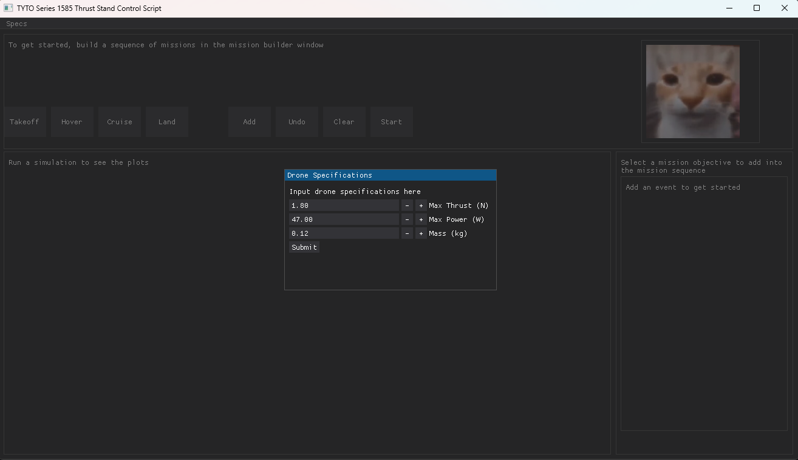
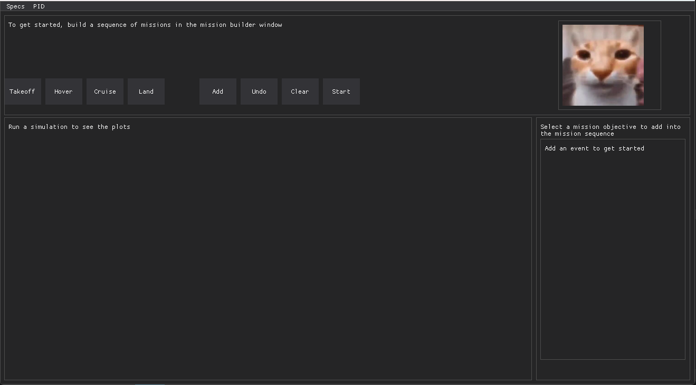
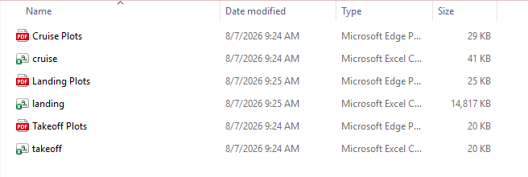
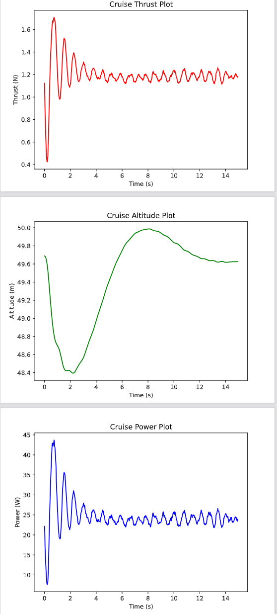

# TYTO Thrust Stand Control Station
The purpose of this program is to generate accurate data measurements to calculate the efficiency of drone propellers and motors. This will be done by running simple drone simulations to generate efficiency data to make informed decisions about parts for any UAV. The simulations are a bit rudimentary as of August 8th, 2026 however they are a great starting point for deciding on UAV parts. This script was my first attempt at making a modular application, most notably the simulations can be edited and completely changed by modifying the Python source code with minimal changes to the entire code.

**PLEASE NOTE: I AM NOT RESPONSIBLE FOR ANY INJURY THAT MIGHT OCCUR DURING THRUST STAND TESTING, IT IS YOUR RESPONSIBILITY TO FOLLOW TYTO'S SAFETY REQUIREMENTS AND TO TEST YOUR THRUST STAND THOROUGHLY BEFORE USING THIS SOFTWARE. DO NOT USE THIS PROGRAM UNLESS THOROUGH TESTING AND SAFETY PRECAUTIONS HAVE BEEN PERFORMED**

## Dependencies

The only dependencies you need is the ***latest version of Python*** installed on your computer and the ***TYTO Flightstand Software*** which requires Windows 10 or 11.

Links to both can be found below to install 

[Tyto Flightstand Software](https://www.tytorobotics.com/blogs/manuals-and-datasheets/software-download)

[Latest Python](https://www.python.org/downloads/)

## Getting Started

Clone the GitHub repository with the command 

`git clone https://github.com/kjamer06/Thrust-Stand-Steady-State-GUI` 

Once cloned run the virtual environment with the command 

`.venv/Scripts/activate`

After entering the venv, ensure that the Flightstand Software is running in the background as this script will not work without it.

Run main.py and you should be greeted with a screen that looks similar to the image below

If you want to do simulated board testing, in main.py change `flightstand_manager = FlightStandManager()` to `flightstand_manager = FlightStandManager(sim=True)`.

This is the place where you input your drone specifications that you plan to use, **this is a required input as the simulations will not work without this input**. To find your max thrust, run initial tests on your motor and propeller with TYTO's provided software or RCBenchmark. **DO NOT USE THIS SOFTWARE WITHOUT PRIOR THRUST STAND TESTING! PLEASE ENSURE YOU HAVE INITIAL MEASUREMENTS BEFORE PROCEEDING**.

After you have input your drone specifications, you can change them anytime by clicking on the **SPECS** tab at the top left of your screen. Additionally, if you need to do PID tuning for a step of the mission, you can edit the parameters in the PID tab on the top left.

This is the main mission window you will be using to build your simulations. The screen is broken up into 3 sections: Event Input, Mission Sequence, and the Plot Window. To start building a mission you select an event at the top (eg. Takeoff) and enter your input parameters for said event. **You should always start with Takeoff and end with Landing.**. Once you have developed your mission, hit enter and your simulations will start. Once they are done you should see some plots in the plot window and the DATA folder in the project directory will populate with MatPlotLib graphs and CSV files for each step of the simulation. **NOTE: IF YOU WANT TO SAVE PLOTS FROM A RUN COPY THE DATA FOLDER ELSEWHERE BEFORE RUNNING EXTRA TESTS, TEST SAVE FUNCTIONALITY IS NOT IMPLEMENTED YET**.

An example of the plot window and data folder should look something like this:

That is the main usage of the software, if you have any questions feel free to reach out and I will happily answer any questions and concerns.